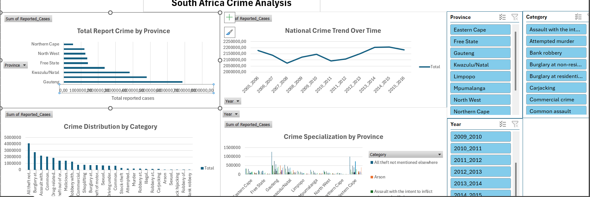

#  South Africa Crime Analysis

##  Overview
This project analyzes South African crime statistics using Microsoft Excel to identify crime patterns across provinces, crime category distribution, long-term trends, and crime specialization by province through an interactive Excel dashboard.

### Dashboard overview:

  

##  Project Objectives
- Clean and prepare raw crime data for analysis
- Transform wide-format data into a tidy, analysis-ready structure
- Perform exploratory data analysis using PivotTables
- Build a professional and interactive Excel dashboard
- Communicate insights clearly using data visualization

##  Dataset
[South African Police Service (SAPS) Crime Statistics.csv](data/)   
**Coverage Includes:**
- Provinces
- Police stations
- Crime categories
- Reporting years (2005–2016)

## Business Questions
- Which provinces report the most crime overall?
- Is crime increasing or decreasing over time?
- Which crime types dominate national statistics?
- What are the crime categories dominating each province?

##  Data Cleaning & Preparation
The raw dataset required several cleaning and transformation steps before analysis.

### Cleaning Steps
- Converted the CSV file to Excel format.
- Standardized column headers.
- Removed duplicate records.
- Identified and removed missing or invalid values.
- Converted multiple year columns into a tidy format using Power Query.
- Ensured correct data types for all columns.

## 📈 Dashboard Features
The Excel dashboard includes the following components:

- **Bar Chart:** Total reported crime by province.  
- **Line Chart:** National crime trends over time.  
- **Column Chart:** Crime distribution by category.
- **Stacked Column Chart:** Crime specialization by province.  
- **Slicers:** Interactive filters for Province, Category, and Year.  

### Final Data Structure
Each row in the cleaned dataset represents:

